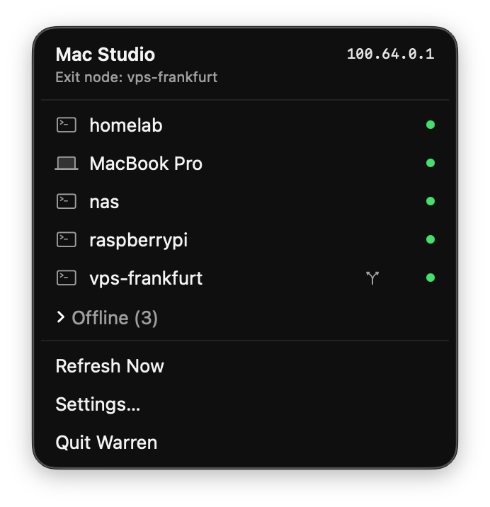
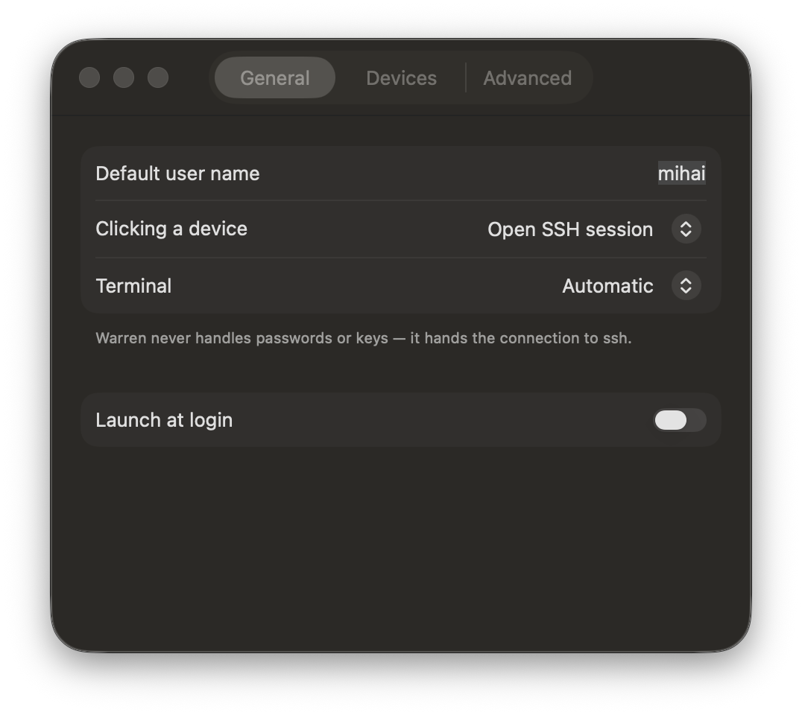

<div align="center">


# Warren

**Your tailnet, one click from the menu bar.**

SSH into any machine on your Tailscale network, open a file transfer session, or grab
its address — without first opening a terminal to look up an IP.

[](#requirements)
[](#building)
[](#building)
[](#no-dependencies)
[](LICENSE)



</div>

---

## Why

Tailscale gives every machine you own a stable name and address. Warren puts them in
your menu bar so you can actually use them: click a device to drop into an SSH session,
right-click for everything else. No Dock icon, no window, no fuss.

It is free, open source, and does not phone home.

## Features

|  | |
| --- | --- |
| **One-click SSH** | Click any device to open a session in your terminal. Ghostty, iTerm2, WezTerm, Kitty, Alacritty and Terminal.app are all supported. |
| **File transfer** | Mount a device over `sshfs` when macFUSE is installed, or hand it to Cyberduck, Transmit or Mountain Duck. |
| **Live status** | Online devices with a green dot, offline ones tucked into a collapsed group with "3 hours ago" timestamps. |
| **Exit nodes** | See which node is carrying your traffic, and switch it from the menu. |
| **Ping** | Check a peer from the Tailscale layer without leaving the menu. |
| **Copy anything** | IPv4, hostname, or a ready-to-paste `ssh` command. |
| **Per-device logins** | A default user name, overridden per machine where you need it. |
| **Search** | Appears once your tailnet outgrows a dozen devices. |
| **Quiet by design** | One glyph in the menu bar, two states, and never a badge count. |

## Requirements

- macOS 14.0 or later — Apple silicon or Intel
- [Tailscale](https://tailscale.com/download) installed and signed in

Warren finds the Tailscale CLI on its own, checking the app bundle first and then
`/usr/local/bin`, `/opt/homebrew/bin` and `/usr/bin`. You can point it somewhere else in
Settings if you keep it elsewhere.

## Install

Warren is not notarized for distribution yet, so build it yourself — it takes about a
minute and needs nothing but Xcode.

```sh
git clone https://github.com/mihaidanielcojocaru/warren.git
cd warren
open Warren.xcodeproj      # then press ⌘R
```

Or from the command line:

```sh
xcodebuild build -scheme Warren -configuration Release -destination 'platform=macOS'
```

The status item appears at the right of your menu bar. There is deliberately no Dock
icon and no main window.

## First run

The first time you open an SSH session **using Terminal.app or iTerm2**, macOS asks
whether Warren may control them. Those two are driven with AppleScript, which is the
only supported way to open a command in a new window, and the prompt is macOS doing its
job.

If you decline, Warren tells you exactly where to change your mind:
**System Settings › Privacy & Security › Automation**.

Ghostty, WezTerm, Kitty and Alacritty take an argument vector instead, so they need no
permission at all. Pick one of those in Settings and you will never see the prompt.

## Using it

**Click** a device to run the default action — SSH, unless you change it.
**Right-click** (or use the ••• button that appears on hover) for the rest:

- **SSH** and **SSH as…** for a one-off user name
- **Open in Finder (SFTP)** / **Mount with sshfs**
- **Copy IPv4**, **Copy Hostname**, **Copy SSH Command**
- **Ping**
- **Use as Exit Node** / **Stop Using Exit Node**, on nodes that offer it

Offline devices keep SSH and file transfer enabled on purpose. Tailscale's idea of
"offline" is a missed heartbeat, and it is often worth trying anyway.

## File transfer, honestly

The Finder cannot mount `sftp://`. Apple removed that years ago, and no amount of
coaxing brings it back — so Warren does not pretend otherwise. Instead it tries, in
order:

1. **`sshfs`**, if it and macFUSE are installed. Mounts to `~/Warren Mounts/<device>`
   and reveals it in the Finder. The same menu item unmounts it afterwards.
2. **An SFTP client** — whatever is registered for `sftp://`, such as Cyberduck,
   Transmit or Mountain Duck.
3. **The clipboard**, with a plain `sftp user@host` command, and an explanation of why
   the first two were not available.

## Settings

<div align="center">

</div>

Default SSH user name · per-device overrides · terminal app · what a click does · poll
interval (5–60s) · path to the `tailscale` binary, with a validity check · launch at
login.

Polling runs at your chosen interval while the menu is open and drops to once a minute
while it is closed — enough to keep the icon honest without spawning a process every ten
seconds in the background.

## Security

Warren is a convenience layer over tools you already trust, and it tries to stay out of
the way of your security model.

- **It never handles credentials.** No passwords, no keys, no Keychain entitlement.
  Authentication is `ssh`'s job, using the keys you already have.
- **Device names are untrusted input.** They come from the network, possibly named by
  someone else on your tailnet. Nothing is ever interpolated into a shell command:
  subprocesses take argument vectors, and there is no `sh -c` anywhere in the codebase.
  The one place a command must become a string — the AppleScript that drives Terminal.app
  and iTerm2 — single-quotes every element and validates hosts and user names first.
- **It phones nobody.** No analytics, no update checks, no listening sockets. Settings
  live in `UserDefaults` and nowhere else.
- **It asks for nothing it does not need.** No Screen Recording, Accessibility, Full Disk
  Access, camera, microphone or contacts.

The App Sandbox is **off**, by necessity: Warren spawns the Tailscale CLI and reads
`/Library/Tailscale`, neither of which survives sandboxing. The hardened runtime is on.

<a id="no-dependencies"></a>
## No dependencies

Foundation, SwiftUI and AppKit. No packages, no vendored code, nothing to audit but the
app itself.

## Building

```sh
xcodebuild build -scheme Warren -destination 'platform=macOS'
xcodebuild test  -scheme Warren -destination 'platform=macOS'
```

The test suite runs entirely offline: the Tailscale CLI and the process layer are both
behind protocols and faked, and the tailnet comes from a checked-in JSON fixture. No test
shells out.

| Layer | What lives there |
| --- | --- |
| `Models/` | Codable models for `tailscale status --json`, plus the domain types the UI uses |
| `Services/` | Process execution, the CLI client, terminal launching, sshfs mounting |
| `State/` | The polling store and settings |
| `UI/`, `Actions/` | Presentation, and the one place side effects happen |

The wire models decode defensively on purpose: `tailscale status --json` is an internal
CLI surface with no compatibility promise, so unknown keys, nulls and changed types all
degrade rather than throw, and a single malformed peer never costs you the others.

## Releasing

Signed and notarized builds go out under Developer ID:

```sh
xcodebuild archive -scheme Warren -configuration Release \
  -destination 'generic/platform=macOS' -archivePath build/Warren.xcarchive

codesign --force --options runtime --timestamp \
  --entitlements Warren/Warren.entitlements \
  --sign "Developer ID Application: YOUR NAME (TEAMID)" \
  build/Warren.xcarchive/Products/Applications/Warren.app

ditto -c -k --keepParent \
  build/Warren.xcarchive/Products/Applications/Warren.app build/Warren.zip
xcrun notarytool submit build/Warren.zip --keychain-profile "warren-notary" --wait
xcrun stapler staple build/Warren.xcarchive/Products/Applications/Warren.app
```

Re-zip **after** stapling — the ticket attaches to the `.app`, not to the archive you
submitted.

## Contributing

Issues and pull requests are welcome. If you have one of the terminals that is hard to
test against — Ghostty, WezTerm, Kitty, Alacritty — confirming that its argument syntax
works on your machine is genuinely useful; see `NOTES.md` for what is verified and what
is not.

## Support

Warren is free and always will be. If it saves you some typing, you can say thanks:

<a href="https://buymeacoffee.com/mihaidanielcojocaru">
  
</a>

## License

[MIT](LICENSE) — use it, fork it, ship it.

---

<sub>Warren is an independent project and is not affiliated with, endorsed by, or
sponsored by Tailscale Inc. "Tailscale" is a trademark of its respective owner.</sub>
